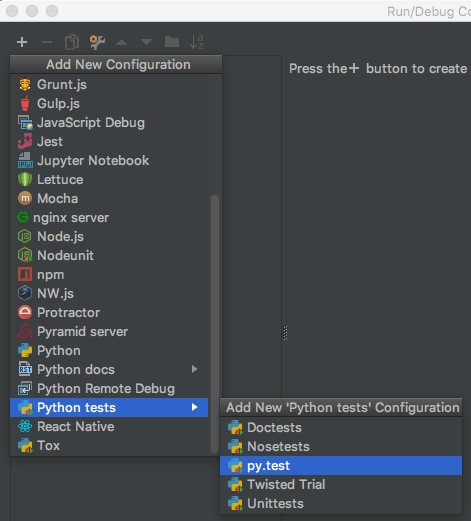

# Your turn: Unit testing

## Objectives

1. Configure purest tests
2. Use code coverage to see how much test coverage you have

## Configure pytest tests

We'll start with an existing project in this folder: `yourtable`.

Create a virtual environment and open it in PyCharm.

To run the tests, you'll need to add a pytest run configuration. In the run configurations, pull it down and choose 'edit'. Then add a new one:

Set the target to `path` with value `./tests.py`. Now run the tests and see they are failing.

## Use code coverage

Next run your tests with coverage. 

See that not much is covered. Open `tests.py` and start implementing tests. Run them with coverage after each one to see how things are improving.

You're done when all tests pass and `core.py` has 100% code coverage.

100% code coverage isn't always a goal (diminishing returns, etc) but it is this time.

